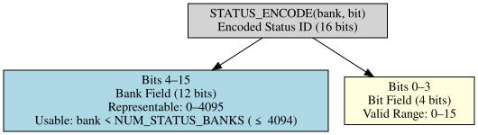

# status

[](https://github.com/aajll/status/actions/workflows/ci.yml)

A lightweight C11 status register library for embedded systems.
Tracks faults, warnings, and info bits using banked bitfields encoded as compact 16-bit status IDs.

## Features

- **Banked bitfields** - Efficient storage using arrays of `uint16_t` across configurable banks
- **Compact IDs** - 16-bit IDs encode both bank and bit index via `STATUS_ENCODE`
- **Three status classes** - Separate fault, warning, and info registers
- **No dynamic memory** - Fixed-size operations, no `malloc` / `free`
- **Atomic bit operations** - Set/clear of a single bit is a lock-free atomic read-modify-write; interrupt- and core-safe with no caller hooks
- **MISRA-oriented** - no VLAs, no dynamic allocation, written with MISRA C:2023 / IEC 61508 in mind
- **Error callbacks** - Runtime notification of invalid IDs or null pointers
- **Snapshot API** - Bulk-copy registers for logging or diagnostics

## Installation

### Copy-in (recommended for embedded targets)

Copy these files into your project tree:

```
include/status.h
include/status_conf.h
src/status.c
```

Then include the header:

```c
#include "status.h"
```

### Meson subproject

Add this repo as a wrap dependency or subproject:

```meson
status_dep = dependency('status', fallback : ['status', 'status_dep'])
```

## Quick Start

### 1. Define Status IDs

Create a `status_ids.h` for your application using the `STATUS_ENCODE` macro:

```c
/* status_ids.h */
#include "status.h"

// Bank 0: Power Faults
#define STATUS_ID_FAULT_OVERCURRENT    STATUS_ENCODE(0u, 0u)
#define STATUS_ID_FAULT_OVERVOLTAGE    STATUS_ENCODE(0u, 1u)

// Bank 1: Thermal Warnings
#define STATUS_ID_WARN_HIGH_TEMP       STATUS_ENCODE(1u, 0u)
```

Each bank holds 16 bits. `bank` must be less than `NUM_STATUS_BANKS`; `bit` must be 0–15.

### 2. Integrate

```c
#include "status_ids.h"

void app_init(void)
{
    status_init();

    /* Optional: register error callback */
    status_set_err_callback(my_error_handler);
}

void check_power(void)
{
    if (voltage > MAX_VOLTAGE) {
        status_set_fault(STATUS_ID_FAULT_OVERVOLTAGE);
    } else {
        status_clear_fault(STATUS_ID_FAULT_OVERVOLTAGE);
    }
}

void check_system(void)
{
    if (status_any(STATUS_CLASS_FAULT)) {
        /* at least one fault is active */
        uint16_t last = status_last_fault();
    }
}
```

### Caller-owned registers

Use `status_reg_t` when subsystems need independent status spaces. Initialise
storage before concurrent use; the existing `status_*` functions continue to
use the library's default register.

```c
static status_reg_t motor_status;

void motor_init(void)
{
    status_reg_init(&motor_status);
    status_reg_set_err_callback(&motor_status, my_error_handler);
}

void motor_check(void)
{
    status_reg_set_fault(&motor_status, STATUS_ID_FAULT_OVERCURRENT);
}
```

## Configuration

Override options with compiler definitions passed consistently when compiling
`status.c` and every translation unit that includes `status.h` (for example,
`-DNUM_STATUS_BANKS=8`):

| Option                                                                        | Description                                                                       | Default |
| ----------------------------------------------------------------------------- | --------------------------------------------------------------------------------- | ------- |
| `NUM_STATUS_BANKS`                                                            | Number of `uint16_t` banks per status class                                       | `12`    |
| `STATUS_USE_GNU_ATOMICS` / `STATUS_USE_C11_ATOMICS` / `STATUS_USE_NO_ATOMICS` | Force the atomic backend instead of auto-discovery                                | auto    |
| `STATUS_ENTER_CRITICAL()` / `STATUS_EXIT_CRITICAL()`                          | Critical-section hooks, consulted **only** on the `STATUS_USE_NO_ATOMICS` backend | no-op   |

## Concurrency

Setting or clearing a single status bit is a genuine atomic read-modify-write on the bank word, so one context may set a bit while another clears a different bit in the same bank without either update being lost. On the two hardware-backed backends this is interrupt- and core-safe by construction, and **no caller-supplied critical section is required** for per-bit operations.

The atomic mechanism is chosen at compile time in `status_conf.h`, auto-discovered as GCC/Clang `__atomic` → C11 `<stdatomic.h>` → a degenerate uniprocessor fallback. The two atomic backends statically assert that the bank word (`uint16_t`) and the error-callback pointer are _always_ lock-free on the target: a target that cannot satisfy that contract fails to compile rather than silently pulling in a hidden lock.

Atomicity is **per call, not per logical group**. A multi-bit observation such as `status_any()` or `status_snapshot()` reads each bank atomically but is not one consistent instant of the whole class, and a set-then-read across two API calls is not a single transaction. A caller that needs grouped atomicity must serialise the group itself.

### Targets without lock-free atomics

On a toolchain with no `<stdatomic.h>` and no `__atomic` builtins (or where 16-bit atomics are not lock-free, e.g. some Cortex-M0-class cores), select `STATUS_USE_NO_ATOMICS` and supply the critical-section hooks. They are consulted only on this backend, must be defined as a matched pair, and must **save and restore** interrupt state rather than unconditionally re-enabling interrupts on exit:

```c
/* Save PRIMASK, then disable interrupts */
#define STATUS_ENTER_CRITICAL() \
        uint32_t _status_irq_state = __get_PRIMASK(); __disable_irq()

/* Restore PRIMASK to whatever it was before ENTER */
#define STATUS_EXIT_CRITICAL() \
        __set_PRIMASK(_status_irq_state)
```

## Building

```sh
# Library only (release)
meson setup build --buildtype=release
meson compile -C build

# With unit tests (default)
meson setup build --buildtype=debug
meson compile -C build
meson test -C build

# Disable tests
meson setup build -Dbuild_tests=false
```

## API Reference

### Lifecycle

```c
void status_init(void);
void status_set_err_callback(status_err_cb_t cb);
```

### Set / Clear

```c
void status_set_fault(uint16_t id);
void status_set_warning(uint16_t id);
void status_set_info(uint16_t id);

void status_clear_fault(uint16_t id);
void status_clear_warning(uint16_t id);
void status_clear_info(uint16_t id);

bool status_test_and_clear_fault(uint16_t id);
bool status_test_and_clear_warning(uint16_t id);
bool status_test_and_clear_info(uint16_t id);
```

Test-and-clear returns the previous bit state and clears it at one atomic point.
Repeated sets before consumption coalesce; this is not an event counter.

### Query

```c
bool status_is_fault_set(uint16_t id);
bool status_is_warning_set(uint16_t id);
bool status_is_info_set(uint16_t id);

bool status_any(enum status_class cls);
void status_clear_all(enum status_class cls);
```

### Last Set

```c
uint16_t status_last_fault(void);
uint16_t status_last_warning(void);
uint16_t status_last_info(void);
```

Returns the most recently set ID for that class. Does not reflect currently active bits — use `status_any()` for that.

### Snapshot

```c
void status_snapshot(enum status_class cls, uint16_t *dst, size_t len);
```

Copies up to `len` banks for the given class into `dst`, capped at
`NUM_STATUS_BANKS`. Passing `len == 0` reports an error.

### ID Encoding Helpers

`STATUS_ENCODE` packs a bank index and bit position into a single 16-bit value:



```c
#define STATUS_ENCODE(bank, bit)   /* compile-time: encode bank + bit → uint16_t */

static inline uint16_t status_bank(uint16_t id);  /* extract bank index */
static inline uint16_t status_bit(uint16_t id);   /* extract bit index  */
```

## Use Cases

1. **Fault management** - Track and query active faults in safety-critical control loops
2. **Warning escalation** - Separate warning state from hard fault state
3. **Diagnostics** - Snapshot registers for logging or transmission over CAN/UART
4. **State encoding** - Compact event/status flags in RTOS tasks or state machines
5. **ISR-safe signalling** - Set status bits from interrupt context with critical section hooks

## Notes

| Topic                 | Note                                                                                                                                                                                                                                                                                                                                    |
| --------------------- | --------------------------------------------------------------------------------------------------------------------------------------------------------------------------------------------------------------------------------------------------------------------------------------------------------------------------------------- |
| **Memory**            | All storage is statically allocated; no heap use                                                                                                                                                                                                                                                                                        |
| **Thread safety**     | Single-bit set/clear is atomic and lock-free on the default backends; multi-bit observations are not a single consistent snapshot. See [Concurrency](#concurrency)                                                                                                                                                                      |
| **Error handling**    | Invalid IDs invoke the registered error callback (if any) and are otherwise ignored                                                                                                                                                                                                                                                     |
| **Version header**    | `status_version.h` is auto-generated by Meson and placed in the build output directory                                                                                                                                                                                                                                                  |
| **Status classes**    | Three independent register sets: `STATUS_CLASS_FAULT`, `STATUS_CLASS_WARNING`, `STATUS_CLASS_INFO`                                                                                                                                                                                                                                      |
| **ID class contract** | Status IDs are plain `uint16_t` values encoding only bank + bit. The library cannot enforce at compile time that a fault ID is passed to `status_set_fault()` rather than `status_set_warning()`. Use the naming convention (`STATUS_ID_FAULT_*`, `STATUS_ID_WARN_*`, `STATUS_ID_INFO_*`) and code review to prevent cross-class usage. |
